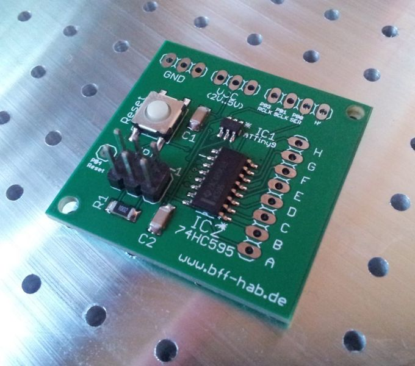
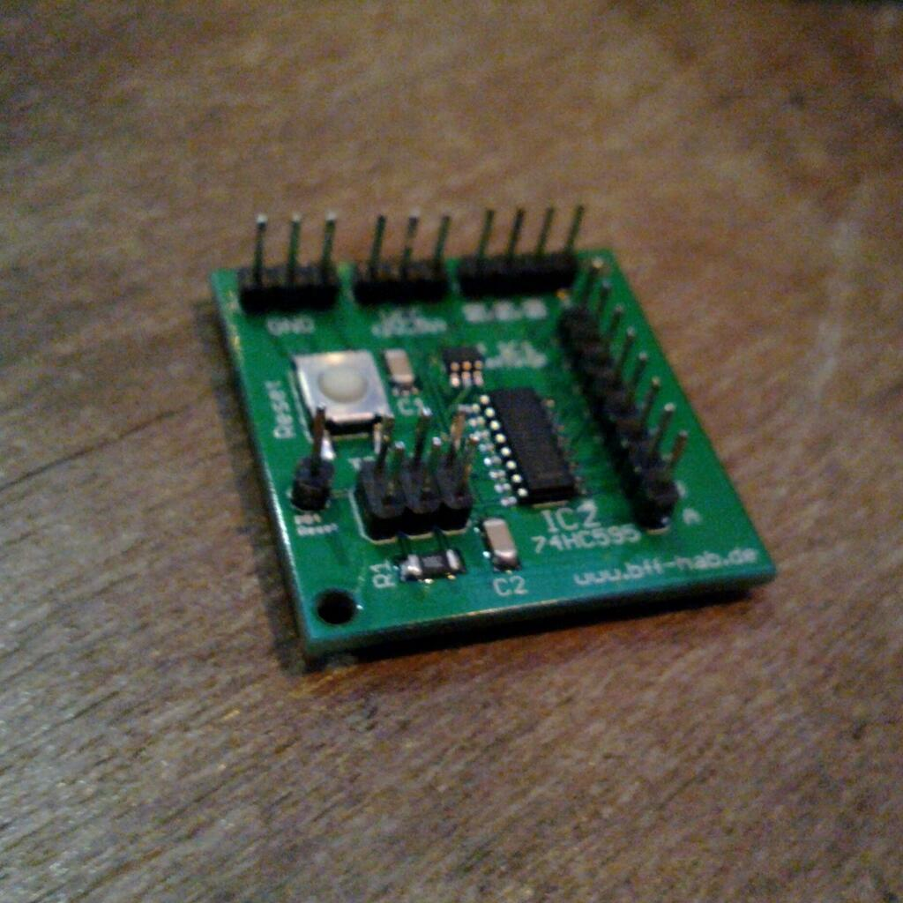

AVR board from SMD workshop at GPN13
====================================

In June 2013 I attended a workshop on SMD soldering at the [Gulaschprogrammiernacht 2013 (GPN13)][1], a German hacker event organized by the regional CCC group in Karlsruhe. The result of a workshop organized by @DrLuke was this small board with an [ATtiny9][2] microcontroller and a [74HCT595][3] shift register.

&nbsp;

The left image shows the unpopulated sample board. My finished board with pin headers already soldered is on the right. Later I changed the pin header for the 8 output pins again to make them point to the bottom. Now the board can easily be used on a breadboard for prototyping.

[1]: https://entropia.de/GPN13
[2]: http://www.atmel.com/devices/attiny9.aspx
[3]: http://www.nxp.com/products/logic/shift_registers/series/74HC_T_595.html
